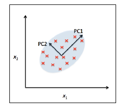
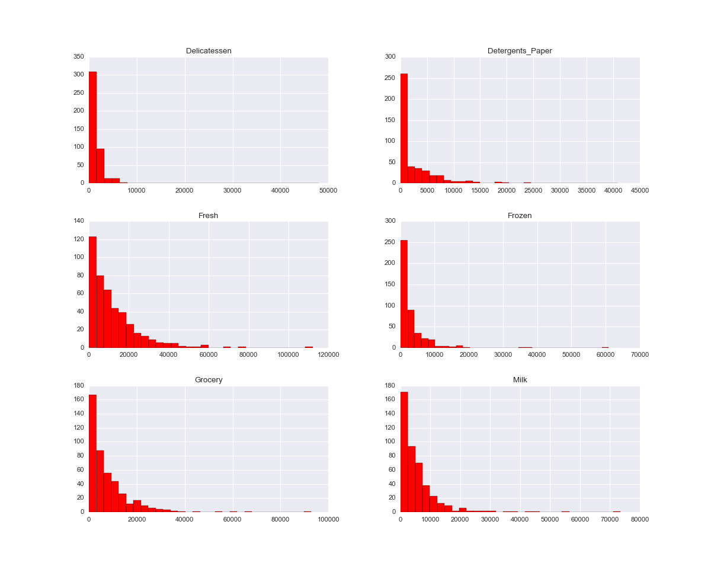
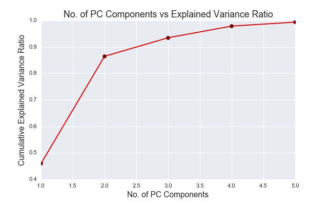
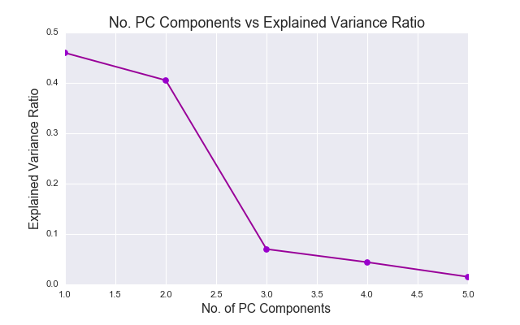

# Creating Customer Segments

### Project in progress (3/16/16)

## Project Description:

- A wholesale grocery distributor wants determine which changes will benefit their business. They recently tested out a change to their delivery method, from a regular morning delivery to a cheaper, bulk evening delivery. Initial tests didn’t discover any significant effect, so they implemented the cheaper option. Almost immediately, they began getting complaints about the change and losing customers. As it turns out, the highest volume customers had an easy time adapting to the change, whereas smaller family run shops had serious issues with it, but these issues were washed out statistically by noise from the larger customers.

- For the future, they want to have a sense of what sorts of different customers they have. Then, when implementing changes, they can look at the effects on these different groups independently. The objective is to use unsupervised learning techniques to see what sort of patterns exist among existing customers, and what exactly makes them different.

## Source Code

- In this directory (`customer_segments/`), run `ipython notebook`, open `customer_segments.ipynb`.

## Software & Libraries:

 - Python 2.7
 - NumPy
 - pandas
 - matplotlib
 - scikit-learn

## Dataset

- The dataset refers to clients of a wholesale distributor. It includes the annual spending in monetary units (m.u.) on diverse product categories. It is part of a larger database published with the following paper:

`Abreu, N. (2011). Analise do perfil do cliente Recheio e desenvolvimento de um sistema promocional. Mestrado em Marketing, ISCTE-IUL, Lisbon.`

## Principal Component Analysis:

- [`Principal Component Analysis`](http://scikit-learn.org/stable/modules/generated/sklearn.decomposition.PCA.html) is an unsupervised linear transformation technique which transforms possibly correlated variables into a smaller number of uncorrelated variables which are referred to as the principal components. The objective of PCA is to identify patterns in data based on the correlation between features. PCA attempts to find the direction with the maximum variance in a high-dimensional dataset and then project it onto a new subspace with equal or fewer dimensions that the original one. 


- The principal components are the underlying structure of the data and the are defined by the directions that maximizes the variance (the direction where the data is most spread out); this minimizes the information loss when projecting onto the new axis. The perpendicular axes (orthogonal) are known principal components of the new subspace can be interpreted as the directions of maximum variance. The first step consists of placing the first axis in the direction of greatest variance of the points to maximize the variance along the corresponding axis. The second axis is orthogonal to it. In higher dimensions (greater than 2) the second axis could lie anywhere in the plane perpendicular to the first axis. As a constraint, the second axis always perpendicular (orthogonal) to the first axis to maximizes the variance along the axis.(The figure shown below source: Python Machine Learning)

- Calculate the covariance matrix of the original coordinates of the points and diagonalize it to find the eigenvectors. These are the axes of the transformed space, sorted in order of eigenvalue—because each eigenvalue gives the variance along its axis.

PCA                        | 
:-------------------------:|
        | 

## Questions:

####Question 1: Before doing any computations, what do you think will show up in your computations? List one or two ideas for what might show up as the first PCA dimensions, or what type of vectors will show up as ICA dimensions.

- The original dataset is plotted in a high dimensional space (D=5) and is represented in terms of Fresh, Milk, Grocery, etc; transforming the data into the new dimensions which is represented now by the PC's. The first PC accounts or the highest portion of the total variance or "spread" of the data. The following PC's account for the remaining variability, and usually the first couple of PC's account for roughly 90-95% of the variance. Before running any PCA, just a quick scan over the histograms (shown below), there seems to be a correlation in the number of orders among `Fresh`, `Milk`, and `Grocery`. Intuitively, the histograms show an exponential decline in the number of orders for the respected products, hence this could represent a cluster of the larger companies. In contrast to the remaining products, the histogram virtually drops off after the first two bins (lower number of orders) and perhaps indicate the smaller company purchases from the wholesale grocery distributor.

  

#### Question 2: How quickly does the variance drop off by dimension? If you were to use PCA on this dataset, how many dimensions would you choose for your analysis? Why?

- The figure below shows the result of transforming the dataset with 5 numeric attributes, corresponding to data points in a high dimensional space (D=5). The plot shows the variance vs the component (n=5). You can use all the components as new attributes for data mining, or you might want to choose just the first few, the principal components and discard the rest. The results show that the first two principal components account for 86.4% of the variance, and the first three components account for 93.4%. therefore a common practice is to standardize all attributes to zero mean and unit variance. In this dataset, all of the dimensions of the wholesale grocery data are in the same units monetary units (m.u.), thus scaling would not apply in this case. For PCA to be implemented correctly, you need to addresses the event where features are on different magnitudes of range or not normally distributed, thus it can cause the results of PCA to be biased in the direction of the features with large range. Using [`StandardScaler`](http://scikit-learn.org/stable/modules/generated/sklearn.preprocessing.StandardScaler.html), the features are standardized by removing the mean and scaling to unit variance.

```python
#Standardize features by removing the mean and scaling to unit variance
from sklearn.preprocessing import StandardScaler

columns = data.columns
sc = StandardScaler()
df_sc = sc.fit_transform(data)
df_scale = pd.DataFrame(df_sc, columns=columns)
```
- Based on the No. Principal Components vs Cumulative Explained Variance Ratio plot (left), the number of dimensions would be reduced to `3`, which explains 93.4% of the variance. In regards to how quickly does the variance drop off, the slope shows that at PC 1-2, the slope is `-0.054` and the slope at PC 2-3 is `-0.335` (figure on right). The slope at PC 3-4 the slope begins to level out some with a slope of `-0.026`; therefore between PC 2-3 you observe the steepest slope where the explained variance ratio begins to quickly decline. 

|   PC   |  Variance |  
| ------ | --------- |    
|   1    | 0.459614  |       
|   2    | 0.405172  | 
|   3    | 0.070030  |
|   4    | 0.044023  | 
|   5    | 0.015022  |

PCA - Cumulative Variance  | PCA - Variance Ratio       |
:-------------------------:|:-------------------------: | 
          |          | 


#### Question 3: What do the dimensions seem to represent? How can you use this information?


#### Question 4: For each vector in the ICA decomposition, write a sentence or two explaining what sort of object or property it corresponds to. What could these components be used for?


#### Question 5: What are the advantages of using K Means clustering or Gaussian Mixture Models?


#### Question 6:  What are the central objects in each cluster? Describe them as customers.

###Conclusions

#### Question 7:  Which of these techniques did you feel gave you the most insight into the data?


#### Question 8: How would you use that technique to help the company design new experiments?


#### Question 9: How would you use that data to help you predict future customer needs?


## Attributes

- Fresh: annual spending (m.u.) on fresh products (Continuous)
- Milk: annual spending (m.u.) on milk products (Continuous)
- Grocery: annual spending (m.u.)on grocery products (Continuous)
- Frozen: annual spending (m.u.)on frozen products (Continuous)
- Detergents_Paper: annual spending (m.u.) on detergents and paper products (Continuous)
- Delicatessen: annual spending (m.u.)on and delicatessen products (Continuous)

## Descriptive statistics

**Attribute: (Minimum, Maximum, Mean, Std. Deviation)**

- Fresh: ( 3, 112151, 12000.30, 12647.329)
- Milk: (55, 73498, 5796.27, 7380.377)
- Grocery: (3, 92780, 7951.28, 9503.163)
- Frozen: (25, 60869, 3071.93, 4854.673)
- Detergents_Paper: (3, 40827, 2881.49, 4767.854)
- Delicatessen: (3, 47943, 1524.87, 2820.106)
